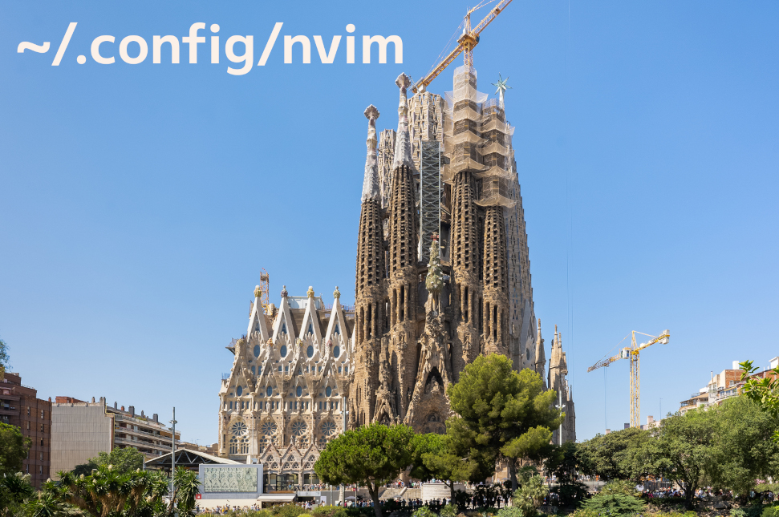

# 

A vanilla+ Neovim configuration.

[![CI][1]][2]
[![Nix flake][3]][4]

## Installation

Install this repository either as usual Neovim configuration
([`:h XDG_CONFIG_HOME`][5]) or as [Nix flake][6].

### As usual Neovim configuration

> [!CAUTION]
> Make sure to back up your configuration
> (`${XDG_CONFIG_HOME:-~/.config}/nvim`) and plugins
> (`${XDG_DATA_HOME:-~/.local/share}/nvim/site/pack`) before trying it!

```console
git clone https://github.com/mnacamura/config-nvim \
    "${XDG_CONFIG_HOME:-~/.config}/nvim"
nvim -es -V1 --headless \
    --cmd ":lua require'my.plugins.paq'.setup()" \
    --cmd :PaqInstall \
    --cmd :5sleep
nvim -es -V1 --headless +":TSInstall all"  # Optional
```

You may want to customize the `:5sleep` command depending on your environment
such as internet connection speed.

### As Nix flake

Just try it:

```console
nix run github:mnacamura/config-nvim -- blabla.txt
```

If you happened to like it, install it to your system:

```console
nix profile install github:mnacamura/config-nvim
```

## Plugins

This repository ships with plugins listed here,
mostly coming from [rockerBOO/awesome-neovim][7].

### Plugin manager

Only for usual Neovim installation.

- [x] [savq/paq-nvim][p01]

### Neovim Lua batteries

- [x] [nvim-lua/plenary.nvim][p02]
- [x] [nvim-lua/popup.nvim][p03]

### Vanilla+ experience

#### Motion improvements

- [x] [tpope/vim-repeat][p04]
- [x] [rhysd/clever-f.vim][p05]
- [x] [haya14busa/vim-asterisk][p06]
- [x] [chrisgrieser/nvim-spider][p07]

#### Extra textobjects

- [x] [chrisgrieser/nvim-various-textobjs][p08]

#### Useful mappings

- [x] [tpope/vim-unimpaired][p09]

#### Insert / command-line mode fixes

- [x] [tpope/vim-rsi][p10]

#### Register improvements

- [x] [gbprod/yanky.nvim][p11]

#### Better marks experience

- [x] [chentoast/marks.nvim][p12]

#### Comment out things

- [x] [numToStr/Comment.nvim][p13]

#### Parentheses utilities

- [x] [m4xshen/autoclose.nvim][p14]
- [x] [utilyre/sentiment.nvim][p15]

#### Extra operators

- [x] [kylechui/nvim-surround][p16]
- [x] [gbprod/substitute.nvim][p17]

#### Neovim better UI

- [x] [stevearc/dressing.nvim][p18]

#### Miscellaneous editing support

- [x] [monaqa/dial.nvim][p19]
- [x] [nacro90/numb.nvim][p20]
- [x] [ethanholz/nvim-lastplace][p21]
- [x] [sQVe/sort.nvim][p22]

#### Project local settings

- [x] [klen/nvim-config-local][p47]

### Look and feel

#### Colorscheme

- [x] [Iron-E/nvim-highlite][p48]
- [x] [m15a/nvim-srcerite][p23]

#### Statusline

- [x] [freddiehaddad/feline.nvim][p24]

#### Cursorline

- [x] [sontungexpt/stcursorword][p25]

#### Quickfix

- [x] [yorickpeterse/nvim-pqf][p26]

#### Icon fonts

- [x] [kyazdani42/nvim-web-devicons][p27]

### Telescopic finders

- [x] [nvim-telescope/telescope.nvim][p28]
- [x] [nvim-telescope/telescope-symbols.nvim][p29]
- [x] [crispgm/telescope-heading.nvim][p30]
- [x] [nvim-telescope/telescope-bibtex.nvim][p31]
- [x] [folke/todo-comments.nvim][p32]

### LSP enhancement

- [x] [neovim/nvim-lspconfig][p33]
- [x] [nvimtools/none-ls][p34]
- [x] [onsails/lspkind-nvim][p35]

### Tree-sitter

- [x] [nvim-treesitter/nvim-treesitter][p36]
- [x] [nvim-treesitter/nvim-treesitter-textobjects][p37]

### Language-specific plugins

#### Nix

- [x] [LnL7/vim-nix][p38]

#### Fennel

- [x] [mnacamura/vim-fennel-syntax][p39]

#### Markdown

- [x] [bullets-vim/bullets.vim][p40]
- [x] [rhysd/vim-gfm-syntax][p41]
- [x] [vim-pandoc/vim-pandoc-syntax][p42]
- [x] [dhruvasagar/vim-table-mode][p43]

#### PureScript

- [x] [purescript-contrib/purescript-vim][p44]

### Tool integration

#### Git

- [x] [lewis6991/gitsigns.nvim][p45]

#### Glow

- [x] [ellisonleao/glow.nvim][p46]

## Licenses

See [`_assets/README`](_assets/README) for the licenses of the cover image.

See [`LICENSE`](LICENSE) for the license of the other materials in this
repository.

[1]: https://img.shields.io/github/actions/workflow/status/mnacamura/config-nvim/ci.yml?style=flat-square&logo=github&label=CI
[2]: https://github.com/mnacamura/config-nvim/actions/workflows/ci.yml
[3]: https://img.shields.io/github/actions/workflow/status/mnacamura/config-nvim/nix.yml?style=flat-square&logo=nixos&logoColor=7ebae4&label=Nix%20flake
[4]: https://github.com/mnacamura/config-nvim/actions/workflows/nix.yml
[5]: https://neovim.io/doc/user/starting.html#%24XDG_CONFIG_HOME
[6]: https://nix.dev/concepts/flakes
[7]: https://github.com/rockerBOO/awesome-neovim
[p01]: https://github.com/savq/paq-nvim
[p02]: https://github.com/nvim-lua/plenary.nvim
[p03]: https://github.com/nvim-lua/popup.nvim
[p04]: https://github.com/tpope/vim-repeat
[p05]: https://github.com/rhysd/clever-f.vim
[p06]: https://github.com/haya14busa/vim-asterisk
[p07]: https://github.com/chrisgrieser/nvim-spider
[p08]: https://github.com/chrisgrieser/nvim-various-textobjs
[p09]: https://github.com/tpope/vim-unimpaired
[p10]: https://github.com/tpope/vim-rsi
[p11]: https://github.com/gbprod/yanky.nvim
[p12]: https://github.com/chentoast/marks.nvim
[p13]: https://github.com/numToStr/Comment.nvim
[p14]: https://github.com/m4xshen/autoclose.nvim
[p15]: https://github.com/utilyre/sentiment.nvim
[p16]: https://github.com/kylechui/nvim-surround
[p17]: https://github.com/gbprod/substitute.nvim
[p18]: https://github.com/stevearc/dressing.nvim
[p19]: https://github.com/monaqa/dial.nvim
[p20]: https://github.com/nacro90/numb.nvim
[p21]: https://github.com/ethanholz/nvim-lastplace
[p22]: https://github.com/sQVe/sort.nvim
[p23]: https://github.com/m15a/nvim-srcerite
[p24]: https://github.com/freddiehaddad/feline.nvim
[p25]: https://github.com/sontungexpt/stcursorword
[p26]: https://github.com/yorickpeterse/nvim-pqf
[p27]: https://github.com/kyazdani42/nvim-web-devicons
[p28]: https://github.com/nvim-telescope/telescope.nvim
[p29]: https://github.com/nvim-telescope/telescope-symbols.nvim
[p30]: https://github.com/crispgm/telescope-heading.nvim
[p31]: https://github.com/nvim-telescope/telescope-bibtex.nvim
[p32]: https://github.com/folke/todo-comments.nvim
[p33]: https://github.com/neovim/nvim-lspconfig
[p34]: https://github.com/nvimtools/none-ls.nvim
[p35]: https://github.com/onsails/lspkind-nvim
[p36]: https://github.com/nvim-treesitter/nvim-treesitter
[p37]: https://github.com/nvim-treesitter/nvim-treesitter-textobjects
[p38]: https://github.com/LnL7/vim-nix
[p39]: https://github.com/mnacamura/vim-fennel-syntax
[p40]: https://github.com/bullets-vim/bullets.vim
[p41]: https://github.com/rhysd/vim-gfm-syntax
[p42]: https://github.com/vim-pandoc/vim-pandoc-syntax
[p43]: https://github.com/dhruvasagar/vim-table-mode
[p44]: https://github.com/purescript-contrib/purescript-vim
[p45]: https://github.com/lewis6991/gitsigns.nvim
[p46]: https://github.com/ellisonleao/glow.nvim
[p47]: https://github.com/klen/nvim-config-local
[p48]: https://github.com/Iron-E/nvim-highlite

<!-- vim: set ft=markdown.gfm tw=80 nowrap: -->
